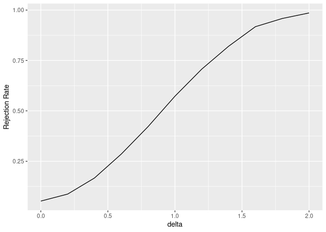

<!-- README.md is generated from README.Rmd. Please edit that file -->

# `cmstatrExt` 

<!-- badges: start -->

[](https://github.com/cmstatr/cmstatrExt/actions/workflows/R-CMD-check.yaml)
<!-- badges: end -->

`cmstatrExt` provides statistical methods intended for composite
material data that are not included in CMH-17-1G.

# Installation

You can install this package from CRAN as follows:

``` r
install.packages("cmstatrExt")
```

# Example Usage

In these examples we’ll use the following packages:

``` r
library(cmstatrExt)
library(tidyverse)
```

Currently, this package provides several functions related to
equivalency tests. Factors for a two-sample dual-acceptance criteria can
be calculated as follows:

``` r
k <- k_equiv_two_sample(
  alpha = 0.05,
  n = 18,  # size of the qualification sample
  m = 6    # size of the acceptance sample
)
k
#> [1] 2.9594727 0.9541395
```

The power of this test for detecting reduction in mean can be computed
as follows:

``` r
power_sim_dual(
  n_qual = 18,
  m_equiv = 6,
  replicates = 2500,
  distribution = "rnorm",
  param_qual = data.frame(mean = 0, sd = 1),
  param_equiv = data.frame(mean = seq(-2, 0, length.out = 11), sd = 1),
  k1 = k[1], k2 = k[2]
) %>% 
  mutate(delta = 0 - mean) %>% 
  ggplot(aes(x = delta, y = `Rejection Rate`)) +
  geom_line()
```

<!-- -->

# Development

If you have a suggestion or question, please create an [issue on
GitHub](https://github.com/cmstatr/cmstatrExt/issues).

If you want to contribute to this package, Pull Requests are welcome!
